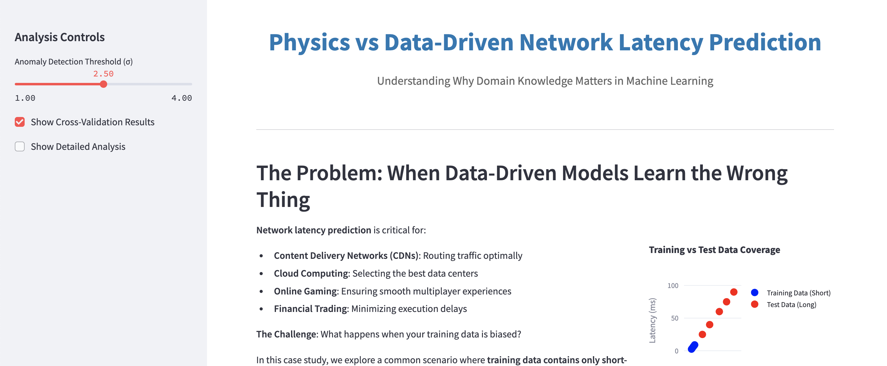

# Physics vs Data-Driven Network Latency Prediction

**An interactive Streamlit application demonstrating why domain knowledge matters in machine learning**

## Overview

This application demonstrates a critical machine learning concept: **how training data bias can lead data-driven models to learn incorrect baselines**, while physics-informed approaches remain robust. 

Using network latency prediction as a case study, we show what happens when models trained on short-distance data must predict worldwide network latencies - a common real-world scenario in distributed systems.



## Key Insights Demonstrated

- **Training Bias Problem**: Data-driven models learn wrong baselines from biased training data
- **Physics Robustness**: Domain knowledge provides reliable foundations regardless of data bias  
- **Distribution Shift**: How model performance degrades when deployment differs from training
- **Interpretability**: Physics-based residuals have clear meaning vs. black-box predictions

## Live Demo

Visit the live application: [**Physics vs Data-Driven Analysis**](your-deployed-app-url)

## Project Structure

```
physics-vs-datadriven/
├── README.md
├── requirements.txt
├── physics_streamlit_app.py          # Main Streamlit application
├── data/
│   ├── enahnced_simulation_train_data.dat    # Training dataset (short distances)
│   └── enahnced_simulation_test_data.dat     # Test dataset (worldwide)
├── screenshots/
│   └── screenshot.png
└── docs/
    └── methodology.md
```

## Installation & Setup

### Prerequisites
- Python 3.8 or higher
- pip package manager

### Quick Start

1. **Clone the repository**
   ```bash
   git clone https://github.com/yourusername/physics-vs-datadriven.git
   cd physics-vs-datadriven
   ```

2. **Install dependencies**
   ```bash
   pip install -r requirements.txt
   ```

3. **Ensure data files are in place**
   - Place `enahnced_simulation_train_data.dat` in the project root
   - Place `enahnced_simulation_test_data.dat` in the project root

4. **Run the application**
   ```bash
   streamlit run physics_streamlit_app.py
   ```

5. **Open your browser** to `http://localhost:8501`

### Docker Setup (Optional)

```bash
# Build the Docker image
docker build -t physics-latency-app .

# Run the container
docker run -p 8501:8501 physics-latency-app
```

## Data Requirements

The application expects two CSV files with the following columns:

### Training Data (`enahnced_simulation_train_data.dat`)
- `geo_distance_km`: Geographic distance in kilometers (< 2000km)
- `measured_latency_ms`: Actual measured network latency
- `physics_latency_ms`: Physics-based latency prediction
- `is_anomaly`: Boolean indicating anomalous measurements

### Test Data (`enahnced_simulation_test_data.dat`)
- Same columns as training data
- Covers full distance range (100km - 20,000km)

## Using the Application

### Main Features

1. **Interactive Analysis Controls**
   - Adjust anomaly detection threshold (1.0σ - 4.0σ)
   - Toggle cross-validation results
   - Show/hide detailed analysis

2. **Comprehensive Visualizations**
   - Data distribution comparison
   - Model prediction comparison
   - Error analysis by distance range
   - Residuals analysis

3. **Performance Metrics**
   - Mean Squared Error (MSE)
   - R² Score
   - Cross-validation results
   - Anomaly detection metrics (Precision, Recall, F1)

### Key Sections

- **Problem Statement**: Business context and challenge explanation
- **Dataset Analysis**: Training vs test data comparison with insights
- **Model Training**: Physics-informed vs data-driven approaches
- **Bias Analysis**: Quantification of learning bias
- **Visualization**: Interactive charts showing the full story
- **Anomaly Detection**: Performance comparison for outlier detection
- **Recommendations**: Actionable insights for production systems

## Methodology

### Physics-Informed Approach
- Uses fundamental physics: `Latency = Distance × (1/Speed_of_Light_in_Fiber)`
- Speed of light in optical fiber: 2×10⁸ m/s
- True slope: 0.005 ms/km
- No training required - pure domain knowledge

### Data-Driven Approach
- Linear regression trained on available data
- 5-fold cross-validation
- Train/validation split (80/20)
- Learns slope and intercept from biased training data

### Anomaly Detection
- Residual-based approach using normalized residuals
- Configurable threshold (default: 2.5σ)
- Evaluation using precision, recall, and F1-score

## Business Applications

This analysis is relevant for:

- **Content Delivery Networks (CDNs)**: Optimal traffic routing
- **Cloud Computing**: Data center selection
- **Online Gaming**: Multiplayer experience optimization  
- **Financial Trading**: Execution delay minimization
- **Video Streaming**: Quality adaptation
- **IoT Networks**: Latency-sensitive applications

## Technical Highlights

### Machine Learning Concepts
- Distribution shift and domain adaptation
- Training bias and generalization
- Cross-validation and model evaluation
- Anomaly detection and outlier analysis
- Physics-informed machine learning

### Technologies Used
- **Streamlit**: Interactive web application framework
- **Plotly**: Interactive visualizations
- **Scikit-learn**: Machine learning algorithms
- **Pandas**: Data manipulation and analysis
- **NumPy**: Numerical computing

## Key Learnings

1. **Domain Knowledge Matters**: Physics provides robust baselines
2. **Data Bias is Dangerous**: Can lead to systematically wrong predictions
3. **Distribution Shift is Real**: Training ≠ Deployment conditions
4. **Hybrid Approaches Work**: Combine physics + data-driven corrections
5. **Interpretability is Crucial**: Understand what your model learned

## Contributing

Contributions are welcome! Please feel free to submit a Pull Request. For major changes, please open an issue first to discuss what you would like to change.

### Development Setup
```bash
# Install development dependencies
pip install -r requirements-dev.txt

# Run tests
python -m pytest tests/

# Format code
black physics_streamlit_app.py

# Type checking
mypy physics_streamlit_app.py
```

## Author

**Your Name**
- Portfolio: [https://suchitakulkarni.github.io/]
- LinkedIn: [https://www.linkedin.com/in/suchitakulkarni/]
- GitHub: [https://github.com/suchitakulkarni/DataScience]
- Email: suchita.kulkarni<at>gmail.com

## Acknowledgments

- Inspired by real-world challenges in network performance monitoring
- Physics constants from telecommunications engineering literature
- Streamlit community for excellent documentation and examples

---

**If you find this project useful, please consider giving it a star!**

*This project demonstrates advanced machine learning concepts through an accessible, interactive application. Perfect for data science portfolios, educational purposes, and understanding physics-informed ML approaches.*
